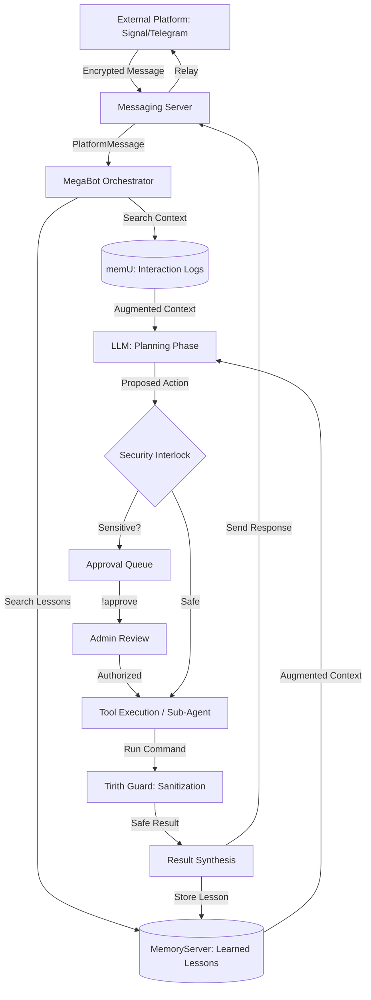

# MegaBot Architecture Deep-Dive 🏗️

MegaBot is a unified AI orchestrator designed for secure, multi-agent coordination. It bridges messaging platforms, persistent memory systems, and powerful execution tools.

## 🔄 Message Lifecycle: The Journey of an Intent

When a message is sent to MegaBot (e.g., from Signal or Telegram), it follows a rigorous path through the system to ensure security and context-awareness.

### 1. Inbound Gateway & Messaging
Messages arrive via the **Unified Gateway** (Cloudflare/VPN) or direct platform adapters. The **MegaBotMessagingServer** normalizes these into a standard `PlatformMessage`. 
- **Signal Integration**: Connects via `SignalAdapter` (JSON-RPC) to `signal-cli`, supporting E2E encrypted group and private chats.

### 2. Memory-Augmented Planning (Phase 4)
Before responding, the Orchestrator performs a **dual-memory lookup**:
- **Reactive Memory (memU)**: Retrieves recent interaction logs and user preferences.
- **Persistent Memory (MemoryServer)**: Retrieves "Learned Lessons" and architectural patterns from previous similar tasks.
The LLM uses this distilled history to generate a plan that avoids past mistakes and leverages proven patterns.

### 3. Orchestration & Sub-Agents
The Master Agent can spawn specialized **Sub-Agents** (Senior Dev, Security Reviewer, QA) with strict **Domain Boundaries**.
- **Pre-flight Planning**: Sub-agents must generate a plan which is validated by the Master Agent before execution.
- **JSON Synthesis**: Results from sub-agents are synthesized into a structured JSON format, extracting "Learned Lessons" to be stored back in Persistent Memory.

### 4. Tool Execution & Security
MegaBot interfaces with:
- **MCP Servers**: 1000+ standardized tools.
- **PageIndex RAG**: Structural, symbol-based codebase navigation.
- **DashDataAgent**: Deep Python-based analysis.

All sensitive actions pass through the **PermissionManager** and **Tirith Guard** (see [SECURITY.md](./SECURITY.md)).

## 📂 Core Component Map

| Directory | Component | Responsibility |
|-----------|-----------|----------------|
| `core/` | `orchestrator.py` | Central brain, mode management, and agent coordination. |
| `core/memory/` | `mcp_server.py` | Persistent SQLite-based cross-session knowledge storage. |
| `core/network/` | `gateway.py` | Secure external access tunnels (Cloudflare, Tailscale). |
| `core/rag/` | `pageindex.py` | Vectorless navigation of codebase symbols and summaries. |
| `adapters/` | `messaging/` | Multi-platform adapters (Signal, Telegram, Discord). |
| `adapters/` | `security/` | Command sanitization and Unicode attack prevention. |
| `features/` | `dash_data/` | Specialized data analysis and Python execution engine. |
| `features/` | `loki.py` | Autonomous "Loki Mode" for full-project implementation. |
| `features/` | `*_README.md` | Integrated documentation for 8 sub-projects (DASH, TIRITH, MEMU, etc.). |
| `ui/` | React frontend | Vite 7 + React 19 + Tailwind 4 dashboard with Vitest test suite. |
