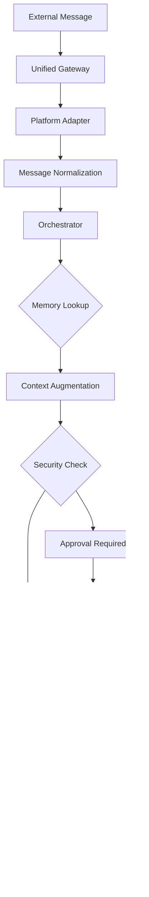

# MegaBot Architecture Overview

Comprehensive guide to MegaBot's system architecture, components, and data flow.

## Table of Contents

- [System Overview](#system-overview)
- [Core Architecture](#core-architecture)
- [Component Breakdown](#component-breakdown)
- [Data Flow](#data-flow)
- [Security Architecture](#security-architecture)
- [Deployment Architecture](#deployment-architecture)

## System Overview

MegaBot is a unified AI orchestrator that combines multiple specialized frameworks into a single, secure, and modular system. The architecture follows a layered approach with clear separation of concerns.

### Key Principles

- **Modularity**: Components are loosely coupled and interchangeable
- **Security First**: Human-in-the-loop approval for all sensitive operations
- **Scalability**: Horizontal scaling through microservice-like adapters
- **Observability**: Comprehensive logging, monitoring, and health checks
- **Local-First**: All data stays on user's infrastructure

### Technology Stack

```
Frontend:     React/TypeScript (Dashboard)
Backend:      Python 3.12+, FastAPI, AsyncIO
Database:     SQLite + pgvector (Memory), PostgreSQL (optional)
Messaging:    WebSocket, HTTP/2, Platform APIs
Security:     AES-256, JWT, Policy Engine
Deployment:   Docker, Docker Compose, Kubernetes
```

## Core Architecture

### Layered Architecture

```
┌─────────────────────────────────────┐
│         External Platforms          │
│  Telegram │ Signal │ Discord │ etc  │
└─────────────────────────────────────┘
                   │
┌─────────────────────────────────────┐
│        Unified Gateway Layer        │
│  Cloudflare │ Tailscale │ Direct    │
└─────────────────────────────────────┘
                   │
┌─────────────────────────────────────┐
│       Messaging Adapters            │
│  Platform normalization & routing   │
└─────────────────────────────────────┘
                   │
┌─────────────────────────────────────┐
│         Core Orchestrator           │
│  Agent coordination & decisioning   │
└─────────────────────────────────────┘
                   │
┌─────────────────────────────────────┐
│      Memory & Context Layer         │
│  memU │ Persistent │ Working Memory │
└─────────────────────────────────────┘
                   │
┌─────────────────────────────────────┐
│        Tool Execution Layer         │
│  MCP Servers │ OpenClaw │ Native    │
└─────────────────────────────────────┘
                   │
┌─────────────────────────────────────┐
│       Security & Permissions        │
│  Approval Engine │ Sanitization     │
└─────────────────────────────────────┘
```

### Component Categories

1. **Adapters**: Platform integrations and external service connections
2. **Core Services**: Business logic and orchestration
3. **Infrastructure**: Databases, caching, networking
4. **Security**: Authentication, authorization, approval workflows
5. **Features**: Specialized capabilities (RAG, voice, vision)

## Component Breakdown

### Core Components

#### Orchestrator (`core/orchestrator.py`)
The central brain of MegaBot that coordinates all activities.

**Responsibilities:**
- Message routing and processing
- Agent lifecycle management
- Mode switching (plan/build/ask/loki)
- Health monitoring and self-healing
- Background task coordination

**Key Classes:**
- `MegaBotOrchestrator`: Main orchestrator class
- `MessageHandler`: Processes incoming messages
- `AdminHandler`: Handles administrative commands
- `HealthMonitor`: System health tracking
- `BackgroundTasks`: Async task management

#### Configuration (`core/config.py`)
Centralized configuration management using Pydantic models.

**Features:**
- Environment variable loading
- Configuration validation
- Dynamic reloading
- Type-safe settings

#### Dependency Injection (`core/dependencies.py`)
Lightweight DI container for service management.

**Services:**
- `Config`: Application configuration
- `MemoryServer`: Persistent memory storage
- `ComputerDriver`: Tool execution
- `ProjectManager`: Project/workspace management
- `SecretManager`: Secure credential storage

### Adapter System

#### Messaging Adapters
Platform-specific integrations for communication.

**Supported Platforms:**
- **Telegram**: Bot API with webhooks, media support, groups
- **Signal**: signal-cli JSON-RPC, E2E encryption
- **Discord**: Full bot integration with slash commands
- **Slack**: Socket Mode API, interactive components
- **WhatsApp**: Business Cloud API with push notifications
- **WebSocket**: Native encrypted WebSocket client

**Adapter Interface:**
```python
class MessagingAdapter(ABC):
    async def send_message(self, message: PlatformMessage) -> bool:
        pass

    async def receive_messages(self) -> AsyncGenerator[PlatformMessage, None]:
        pass

    async def get_health(self) -> AdapterHealth:
        pass
```

#### Tool Adapters

**MCP (Model Context Protocol) Adapter (`adapters/mcp_adapter.py`)**
- Manages 1000+ standardized tools
- Server lifecycle management
- Tool discovery and execution
- Error handling and retries

**OpenClaw Adapter (`adapters/openclaw_adapter.py`)**
- Terminal and file system access
- Command execution with approval interlock
- Output streaming and formatting
- Security sanitization

### Memory System

#### Three-Tier Memory Architecture

1. **Working Memory**: Current conversation context (Redis/in-memory)
2. **Proactive Memory (memU)**: Pattern recognition and anticipation
3. **Persistent Memory**: Long-term knowledge storage (SQLite + pgvector)

#### Memory Components

**Memory Server (`core/memory/mcp_server.py`)**
- SQLite-based storage with vector extensions
- Chat history persistence
- Learned lessons storage
- Cross-session context continuity
- Encrypted backups

**PageIndex RAG (`core/rag/pageindex.py`)**
- Vectorless codebase navigation
- Symbol-based search
- Code structure understanding
- Context-aware retrieval

### Security Components

#### Permission Manager (`core/permissions.py`)
- Policy-based access control
- Command pattern matching
- Approval workflow management
- Persistent policy storage

#### Tirith Guard (`adapters/security/tirith_guard.py`)
- Command sanitization
- Unicode attack prevention
- Dangerous pattern detection
- Safe execution boundaries

#### Visual Redaction (`core/orchestrator.py`)
- Automatic sensitive content detection
- Image blurring and redaction
- Multi-pass verification
- Approval escalation

## Data Flow

### Message Processing Flow



### Approval Workflow


### Memory Data Flow


## Security Architecture

### Defense in Depth

1. **Network Layer**
   - Encrypted WebSocket connections (Fernet AES-128)
   - Rate limiting (configurable per endpoint)
   - IP-based restrictions

2. **Application Layer**
   - Input validation and sanitization
   - Command pattern matching
   - Human-in-the-loop approval

3. **Execution Layer**
   - Sandboxed command execution
   - Resource limits and timeouts
   - Output filtering

4. **Data Layer**
   - Encrypted storage
   - Access control policies
   - Audit logging

### Approval Interlock System

**Trigger Conditions:**
- File system operations (read/write/delete)
- Network commands (curl, wget, ssh)
- System administration (service management, package installation)
- Dangerous shell patterns (rm -rf, mkfs, dd)

**Approval Methods:**
- Chat commands (`!approve`, `!deny`)
- Web dashboard approval
- Voice call escalation (Twilio integration)
- Persistent policies for trusted commands

### Visual Security

**Redaction Pipeline:**
1. Image analysis for sensitive content (API keys, passwords, faces)
2. Automatic blurring of detected regions
3. Secondary verification pass
4. Approval blocking for failed verification

## Deployment Architecture

### Container Architecture

```
┌─────────────────────────────────────┐
│             MegaBot                 │
│  ┌─────────────────────────────────┐ │
│  │    Orchestrator (FastAPI)      │ │
│  │    Port: 8000                   │ │
│  └─────────────────────────────────┘ │
│                                     │
│  ┌─────────────────────────────────┐ │
│  │   Messaging Server (WebSocket) │ │
│  │   Port: 18790                   │ │
│  └─────────────────────────────────┘ │
│                                     │
│  ┌─────────────────────────────────┐ │
│  │   Memory Database (SQLite)      │ │
│  └─────────────────────────────────┘ │
└─────────────────────────────────────┘
```

### Multi-Container Setup

**Services:**
- `megabot`: Main application container
- `postgres`: Optional PostgreSQL database
- `ollama`: Local LLM inference
- `redis`: Working memory cache
- `nginx`: Reverse proxy and load balancer

### Network Architecture

**Internal Networking:**
- Container-to-container communication via Docker networks
- Service discovery through environment variables
- Health checks and automatic restarts

**External Access:**
- Cloudflare Tunnel for public access
- Tailscale VPN for private mesh networking
- Direct HTTPS with TLS termination
- Localhost fallback for development

### Scalability Considerations

**Horizontal Scaling:**
- Stateless orchestrator containers
- Shared memory database
- Load balancer distribution
- Session affinity for WebSocket connections

**Resource Management:**
- Memory limits per container
- CPU allocation based on workload
- Automatic scaling based on message volume
- Resource monitoring and alerting

### Backup and Recovery

**Automated Backups:**
- Memory database snapshots every 12 hours
- Encrypted backup storage
- Point-in-time recovery
- Cross-region replication (optional)

**Disaster Recovery:**
- Container restart policies
- Health check based restarts
- Automatic failover to backup instances
- Data consistency verification